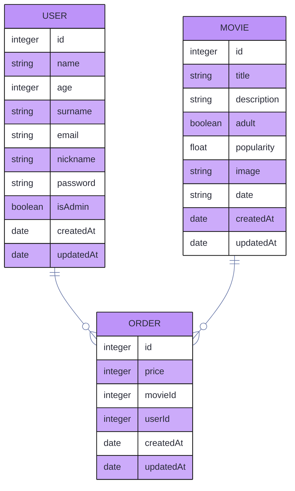

<a name="top"></a>

# backend-peliculas

<div align="center">


Esta es una API REST de una página web de compra de peliculas online, basada en node.js, con encriptación de contraseñas, con sistema de token y con sequelize como orm y mySQL como base de datos compuesta por las siguientes tablas `usuarios`, `peliculas`, `pedidos` y `pagos`.
</div>
<br/>


## Tabla de contenidos
* [Instalacion](#Instalación)<br>
* [Uso de la API](#Uso-de-la-API)<br>
* [Contenido 3](#item3)<br>
* [Contenido 4](#item4)<br>

 [3. Como Usar:](#3-descripción-del-proyecto)<br>
   
### Instalación
***

1. Abre la carpeta donde quieres copiar el repositorio con tu IDE.
2. Clona el repositorio:

    ```bash
    git clone git@github.com:RafaelOrti/backend-peliculas.git
    ```
3. Accede a la carpeta:
    ```bash
    cd backend-peliculas
    ```

4. Instala las dependencias:

    ```bash
    npm i
    ```

5. En `config/config.json` modifica:

    ```json
    "development": {
        ...,
        "password": "tu-contraseña",
        "database": "nombre-de-tu-base-de-datos",
        ...
    }
    ```

6. Creación de la base de datos:

    **Debes de descargar mySQL y tenerlo iniciado en tu PC**. 

* Crea la base de datos:
    ```bash
    npx sequelize db:create
    ```

* Haz las migraciones:

    ```bash
    npx sequelize db:migrate
    ```
 
6. Inicializa el servidor:

    ```bash
    npm run dev
    ```


## Uso de la API


### Detalles de diseño

Se resaltan los diferentes aspectos del diseño:
* Animaciones de ataque
* Menú de selección
* Repetibilidad del juego
* Pantallas de carga


### Mejoras a futuro

Se tiene prevista incluir la funcionalidad de los siguientes elementos:
* Proporcionalidad de tipo de ataque
* Mejora de diseño
* Modo captura pokemon

## Tecnologias
***

## 2. Descripción del proyecto.

## Instalacion
***
 
```
$ git clone git@github.com:oriolCode/web-restaurante.git
$ cd ../path/to/the/index.html
$ npm start index.html
```
Esta pagina web esta especialmente diseñado para ```Google chrome``` donde su rendimiento será mejor.

## FAQs
***

1. __Es compatible con otros navegadores:__ 
Si, lo es.


## Installing


# Using the API

## Data Base draw


### Expected Behaviour

`createdAt`, `updatedAt`, `id`, are obligatory and auto-generated.

the `id` is the **Primary Key** of the tables.

USER `name`, `email`, are obligatory.

USER `email`, `nickname`, are unique.

MOVIE `title`, `description`, `adult`, are obligatory.

ORDER `movieId`, `userId`, `date`, are obligatory.

`movieId` and `userId` are the MOVIE and the USER **Foreign Key** respectively.

You may see references for the **Primary Key** as `pk` and for the **foreign key** as `fk`.

## Endpoints

To see the endpoints and how they works, check our [documentation](https://github.com/luigiMinardi/movieClubBackend/wiki).

<div align="center">

[](https://github.com/luigiMinardi/movieClubBackend/wiki)
</div>

# WIP

[] - Improve admin rights

[] - Creation of payment

[] - Refactor of view-controllers to be more restfull

[] - turn some endpoints in more generic versions of them to be more scalable

[] - Automated tests

[] - Adding error responses to the documentation